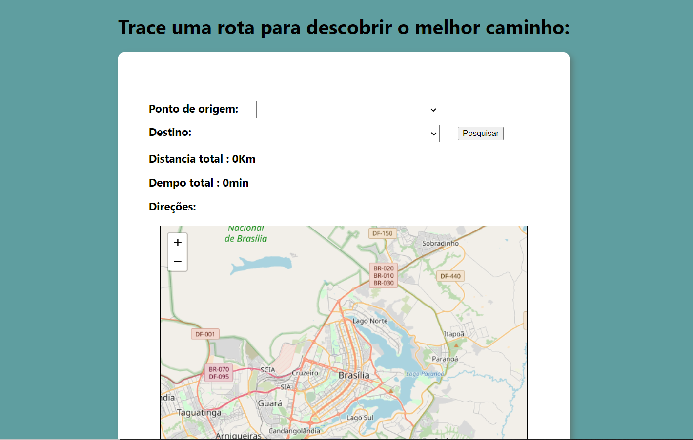
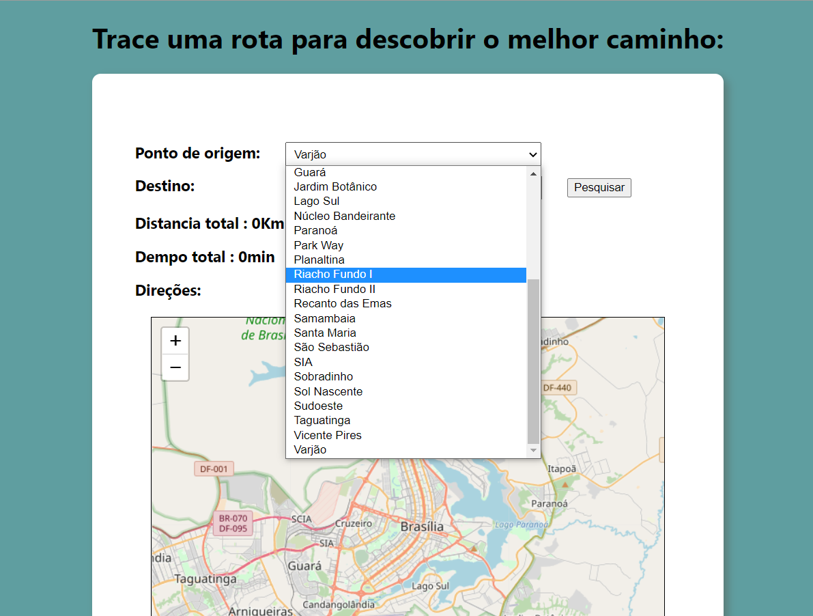
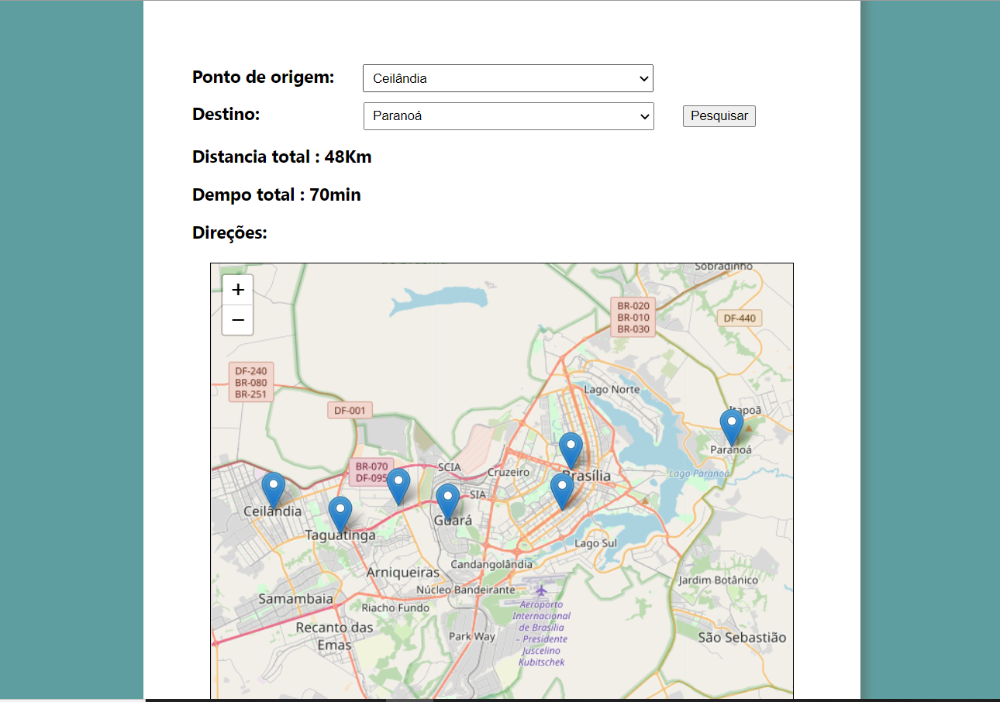

# Trabalho final

**Número da Dupla**: 6 <br>
**Conteúdo da Disciplina**: Grafos <br>

## Alunos

**Matrícula** | **Aluno** 
:-----------: | :---------:
16/0022673    | Ailamar Alves Guimarães
17/0080307    | Matheus Amaral Moreira

## Sobre 

Nesse projeto final a dupla busca atualizar e melhorar a aplicação contruída inicialmente no semestre utilizando os métodos de melhor caminho adquiridos nas aulas, partindo da ideia de apps de serviço de pesquisa de mapas e rotas. Nossa aplicação consiste em retornar ao usuário o melhor caminho entre uma região administrativa e outra em relação à distância até a cidade de destino.

## Screenshots

- Tela inicial   
<br>



- Tela de Busca   
<br>


<br>

- Mapa de rotas  
<br>




## Instalação 
**Linguagem**: JavaScript <br>
**Framework**: Node JS, React JS<br>

Nosso projeto consiste nas tecnologias NodeJS e um arquivo JS como motores.

1. Abra o terminal em uma pasta e faça o clone do repositorio do GitHub para sua máquina:
```
$ git clone https://github.com/projeto-de-algoritmos/Final_RotasDF2.0.git
```

2. O segundo passo é entrar na pasta do repositório e instalar as dependências do NodeJS (para isso você deve ter o NodeJS já instalado):
```
$ cd ./Final_RotasDF2.0/backend/src
$ npm install
```

```
$ cd ./Final_RotasDF2.0/frontend
$ npm install
```

3. Inicie o servidor com o comando no teminal do backend/src:
```
$ node .
```
4. Inicie o cliente com o comando no teminal do frontend:
```
$ npm start
```

5. Com a página iniciada faça suas buscas pelas cidades que deseja saber o caminho.

## Uso 

Selecione uma cidade no primeiro bloco, uma cidade no segundo bloco e clique em pesquisar. O resultado vai a rota com a menot distância e tempo da origem até o destino.

## Outros 

Para encontrar o melhor caminho o algoritimo utilizado nesse projeto foi o Dijkstra.


